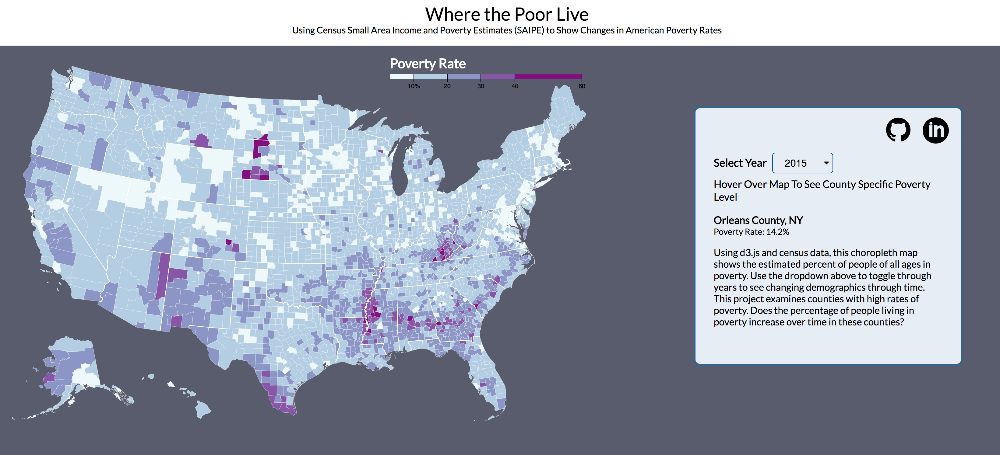

# Mapping Poverty
How are the demographics of poverty changing? [*Mapping Poverty*](https://swetagsanghavi.github.io/MappingPoverty/) is a visual exploration of the US census data on poverty by county over time.

## About
US Census Bureau Poverty County estimates were collected from 2012 to 2015 and mapped on a choropleth to visualize what happens to impoverished counties over time.



## Implementation

Using d3.js, poverty data was mapped to a choropleth map. First a d3 Scale was created to map from our poverty rate data to an output range used in our map.


```js
const x = d3.scaleLinear()
    .domain([3, 50])
    .rangeRound([600, 860]);

const color = d3.scaleThreshold()
    .domain([10, 20, 30, 40, 60])
    .range(d3.schemeBuPu[5]);
```

Both poverty rate and TopoJSON data are loaded asynchronously. Using the queue.js library, our map was drawn via a callback function called after data was loaded and county lines were drawn. A simplified version of the code is seen below, where the `key` is the column heading for the year specified by the dropdown value. The `processData` function draws county and state lines based on the TopoJSON.

```js
d3.queue()
.defer(d3.json, "https://d3js.org/us-10m.v1.json")
.defer(d3.tsv, "./data/PovertyEstimates_all_years.tsv", d => (PovertyEstimates.set(d.id, d[key])))
.await(processData);
```

Small Area Income and Poverty Estimates (SAIPE) are published by the US Census Bureau by combining data from administrative records, postcensal population estimates, and the decennial census with direct estimates from the American Community Survey.
Additionally, U.S. Census Bureau regularly publishes cartographic boundary shapefiles. These can be converted to TopoJSON with the use of shp2json, ndjson-cli, and additional tools. This project uses TopoJSON county boundaries graciously provided by [*Mike Bostock*](https://github.com/topojson/us-atlas).
